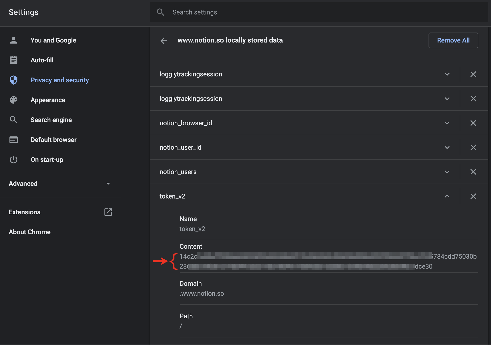

# Notion to bookmarks

This little webapp will generate a JSON bookmarks document from a Notion page.

This is intended to be used with [bbt](https://github.com/BoD/bbt).

An instance is running here: https://notion-to-bookmarks.herokuapp.com/

## How to use

### TL;DR
https://notion-to-bookmarks.herokuapp.com/`NOTION_COOKIE`/`PAGE_ID`

### In more words

You need to craft a URL of this form:

https://notion-to-bookmarks.herokuapp.com/`NOTION_COOKIE`/`PAGE_ID`

where:

- `NOTION_COOKIE` is your personal Notion cookie value used to
identify you and allow accessing the Notion API.
- `PAGE_ID` is the id of the page that you want to turn into bookmarks

#### How to get your Notion cookie?
1. Go to https://www.notion.so with Chrome and make sure you're logged in
1. Go to [chrome://settings/cookies/detail?site=www.notion.so](chrome://settings/cookies/detail?site=www.notion.so), 
which will show you a list of cookies for this website
1. Find the one named `token_v2`, click on the arrow to expand, and copy the
value of the **Content** field.  It should be a long string of digits and letters.

#### How to get your page id?
The page id is the **last part** of the URL of the Notion page you're interested in.

So for instance, given this Notion page:

https://www.notion.so/mycompany/Very-interesting-page-99b251d56eaf46bd91df184f11607f8c

The page id is `99b251d56eaf46bd91df184f11607f8c`.

As you can see it is a shorter string of digits and letters.

#### And of course
Obviously, do not pick a page that has too many sub pages (for instance, 
the root folder of your whole Notion instance), the resulting bookmark
document would be too deep!

## Licence

Copyright (C) 2020-present Benoit 'BoD' Lubek (BoD@JRAF.org)

This program is free software: you can redistribute it and/or modify it under the terms of the GNU General Public License as published by the Free Software Foundation, either version 3 of the License, or (at your option) any later version.

This program is distributed in the hope that it will be useful, but WITHOUT ANY WARRANTY; without even the implied warranty of MERCHANTABILITY or FITNESS FOR A PARTICULAR PURPOSE. See the GNU General Public License for more details.

You should have received a copy of the GNU General Public License along with this program. If not, see http://www.gnu.org/licenses/.